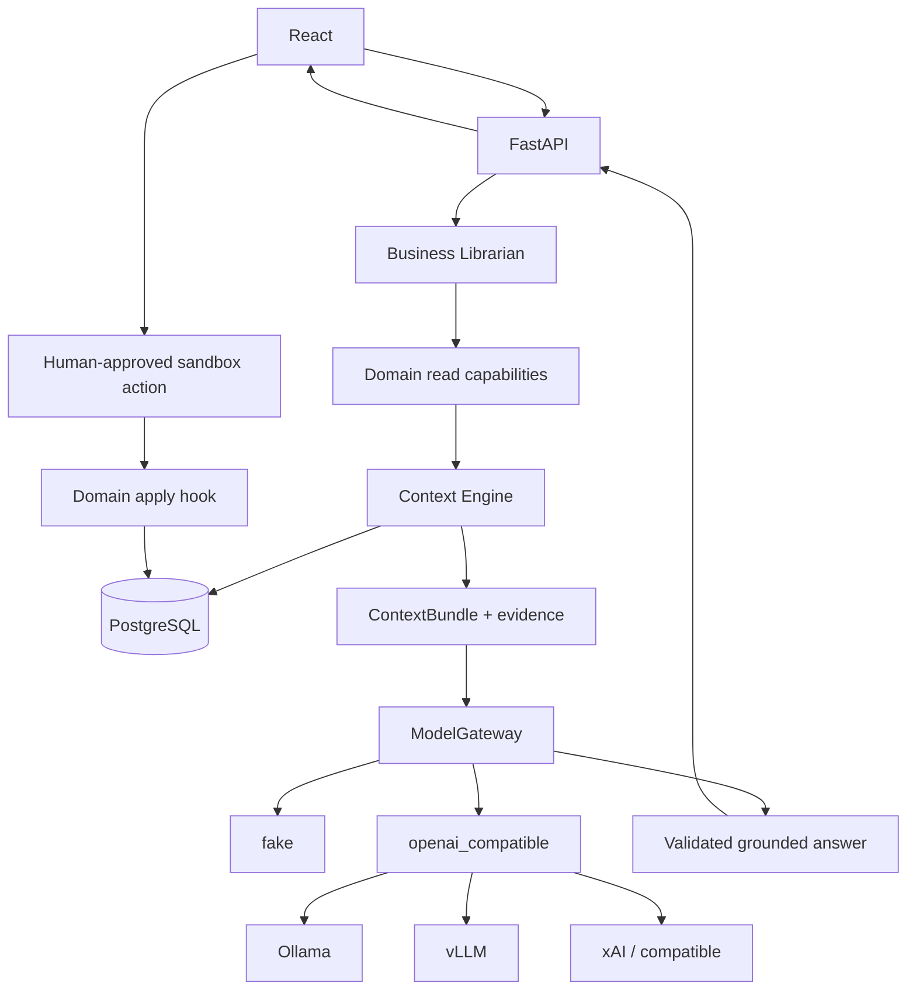
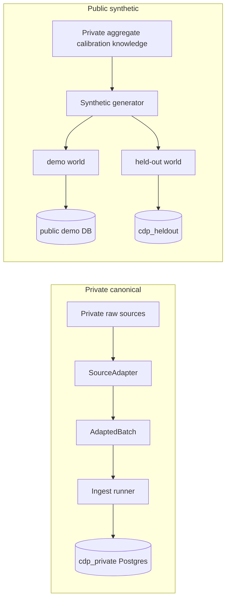
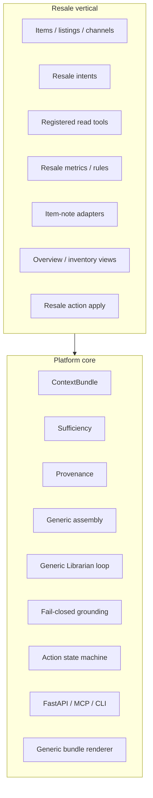
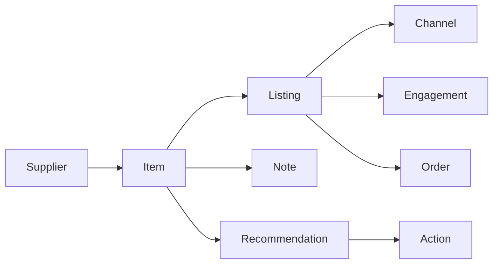
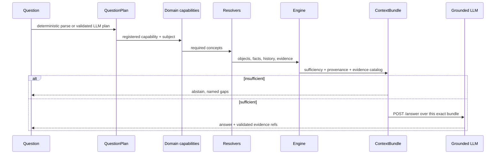
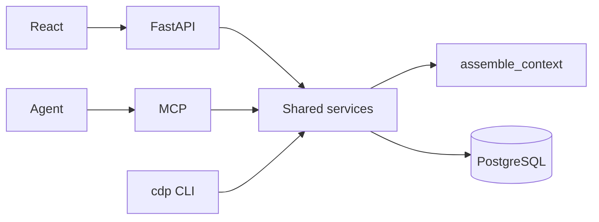

# Architecture

How operational context is built and read. The README is the overview.

**CURRENT** is what the code does. **NEXT** is not in the repository.

The resale domain is the first implementation. Context contracts and
interface layers are kept separate from domain-specific resolvers,
metrics, and rules so additional operational domains can reuse the same
context machinery. The repository does not currently implement other
businesses.

## System



PostgreSQL owns structured operational truth. The engine assembles a
typed bundle for one question. Interfaces share that assembly; they do
not reimplement domain logic.

## Data boundaries



Private rows never enter git. Public worlds copy lifecycle *patterns*,
not records.

## Core vs resale



## Resale object graph



## Question to context



Deterministic parsing remains CI, gold questions, and fallback. An optional
LLM planner may map natural phrasing onto registered capabilities. Neither
path may emit SQL. Invalid planner output falls back to the deterministic
parser — it is not guessed.

Grounding fails closed: malformed JSON, unknown citations, missing citations
on a non-abstaining answer, or an unregistered suggested action are not
trusted answers.

## Runtime interfaces



## CURRENT vs NEXT

```
CURRENT
=======
private item-note adapter → isolated cdp_private
public JSONL worlds (demo / held-out) from synthetic/resale/
        → SourceAdapter → AdaptedBatch
        → ingest runner (hash skip, quarantine, one transaction, lineage)
        → PostgreSQL
        → domain services + context engine
        → CLI / FastAPI / MCP / React operator workspace
        → POST /answer (Librarian: registered tools + exact ContextBundle + grounding)
        → human-approved sandbox action → listing_events / item_events
        → recent_changes diffs live projection vs reconstructed prior snapshot
        → eval layers: assembly / planning / grounding / librarian (FakeProvider)
        → Data Steward profile/propose/review (PROPOSED contract only)

NEXT
====
marketplace listing/order/engagement adapters when those files exist
Redis only if evaluation/model runs become async jobs
operator-defined numeric pricing policy (not invented here)
```

## Technology decisions

| Tech | Decision | Responsibility |
|------|----------|----------------|
| PostgreSQL | **CURRENT** canonical store | Objects, history, ingest audit, sandbox actions, notes |
| JSONL sample_data/ | seed / replay input | Public synthetic worlds. Not a second truth. |
| DuckDB | **REMOVED** | No remaining distinct responsibility |
| SQLite actions | **REMOVED** | Actions live in `ops.actions` |
| Redis | **NOT YET** | No async job/cache/runtime need |
| dbt / Polars / Neo4j / Kafka / Spark / Airflow / K8s | **NOT ADOPTED** | No capability they uniquely unlock here |
| MCP | **CURRENT** | Typed tools over shared services |
| React/TS | **CURRENT** | Operator workspace (objects + Librarian) |
| LLM copilot | **CURRENT** | ModelGateway: fake default; openai_compatible for Ollama/vLLM/xAI; fail-closed grounding; Business Librarian; Data Steward proposals |
| Lexical retrieval baseline | **CURRENT (eval)** | TF-IDF vs gold ids. Not the architecture. Not RAG. |

## ContextBundle

`assemble_context(question, as_of?, domain?) → ContextBundle`

Fields: question, intent, as_of, objects, relationships, facts, metrics,
events, applicable_rules, applicable_policies, retrieved_evidence,
provenance, missing_context, sufficient, why, requirements,
evidence_units / evidence_catalog.

`sufficient` is true only when every required concept for the intent is
present. It is not a numeric confidence.

## Evaluation

`evals/context_questions.py` is GOLD / DEVELOPMENT (demo world).
`evals/heldout_questions.py` is HELD OUT (World B, different seed and SKUs).
Both score the engine, not an LLM.

`cdp eval --compare` / `GET /eval/compare` scores a lexical TF-IDF
baseline on the same ids. Call it lexical retrieval, not RAG.
`cdp eval --answers` / `GET /eval/answers` scores the grounded copilot
contract (FakeProvider) on those ids. `cdp eval --plan` and
`cdp eval --librarian` are separate layers. CI fails on engine FAIL or SKIP.
See docs/ai.md.
