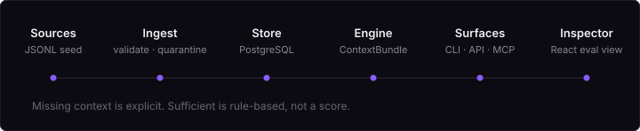

# Commerce Data Platform

[](https://github.com/sebmvp/commerce-data-platform/actions/workflows/test.yml)

A reproducible operational data platform that ingests, validates, models, and serves resale-commerce data through a DuckDB warehouse.

**Python · DuckDB · FastAPI · Docker · pytest · GitHub Actions**

- 8 ingestion streams
- idempotent ingestion (re-running a build is provably a no-op)
- content-hash change detection
- validation + rejected-record quarantine
- historical / SCD-2 modeling
- ingest auditing (every run recorded with read/loaded/rejected counts)
- analytics + API layer

## Architecture



## Quick start

```bash
git clone https://github.com/sebmvp/commerce-data-platform
cd commerce-data-platform
docker compose up build        # builds the warehouse from the bundled synthetic data
docker compose up api          # FastAPI read layer at http://localhost:8000/docs
```

Or without Docker:

```bash
python -m venv .venv && source .venv/bin/activate
pip install -e ".[dev,api]"
cdp build --sample
cdp status
cdp report funnel
```

Actual output:

```
$ cdp build --sample
Schema initialized: warehouse.duckdb
  [ok ] core.channels                read=  3 loaded=  3 rejected=  0
  [ok ] catalog.items                read= 12 loaded= 12 rejected=  0
  [ok ] catalog.item_events          read= 39 loaded= 39 rejected=  0
  [ok ] sales.listings               read=  9 loaded=  9 rejected=  0
  [ok ] sales.engagement_metric      read= 71 loaded= 71 rejected=  0
  [ok ] sales.orders                 read=  6 loaded=  6 rejected=  0
  [ok ] insights.content_pieces      read=  9 loaded=  9 rejected=  0
  [ok ] insights.content_snapshot    read=  9 loaded=  9 rejected=  0
Refreshed 1 voice profile version(s)
Build complete.

$ cdp status
db: warehouse.duckdb (6.3 MB)
  items              12      voice_profiles     1
  item_events        39      rejected_records   0
  listings            9      ingest_runs        8
  orders              6
```

Re-running the same build demonstrates idempotency — sources are unchanged, so nothing is re-ingested and no duplicates appear:

```
$ cdp build --sample
  core.channels                    unchanged (skipped)
  catalog.items                    unchanged (skipped)
  ...                              unchanged (skipped)
  rejected_records   0      ingest_runs  still 8 (skip runs are not counted)
```

The bundled dataset is intentionally small — it is a **deterministic demo fixture** (generator committed, safe to share), not a scale claim. See [docs/assumptions.md](docs/assumptions.md) for the distribution reasoning.

## Engineering decisions

1. **Canonical inputs preserved.** Every row keeps its raw source payload (`raw_json`) and origin file. The DuckDB file is a cache — delete it and `cdp build` rebuilds losslessly.
2. **Idempotent ingest.** Natural-key upserts plus content-hash skip detection: unchanged sources are not re-processed, re-runs never duplicate rows.
3. **Validation before insert.** Pydantic models per stream; failing rows are quarantined to `core.rejected_records` with reasons — never silently dropped.
4. **Event-sourced supply chain.** `catalog.item_events` is append-only truth; `catalog.items` is the latest projection.
5. **SCD-2 dimensions.** Fee/standing history is versioned so point-in-time queries return the state as of any date.

## Data quality

Every run writes an `core.ingest_runs` audit record (source, read/loaded/rejected counts, duration, content hash). Rejected rows are stored with the validation error and raw payload, so bad data is inspectable rather than invisible.

## Tests & CI

```bash
pytest -q          # 15 tests incl. ingest idempotency
```

GitHub Actions runs the suite, a from-scratch `cdp build --sample` smoke build, and a Docker image smoke build on every push to `main`.

## API

`cdp serve` starts a FastAPI read layer over the warehouse: `/health`, `/inventory/summary`, `/inventory/unlisted`, `/listings/performance`, `/insights/voice-profiles`, `/ingest/runs` (interactive docs at `/docs`).

## Things testing caught

- Ingest re-runs duplicating rows before content-hash skip detection was added — now covered by an idempotency test that builds twice and asserts stable counts.
- A CI Docker smoke step where `build` and `status` ran in separate `--rm` containers, so the warehouse vanished between steps — the workflow now shares a volume, and the failure mode is documented in the commit history.

## Reference

| Layer | Path | Role |
|-------|------|------|
| Schema | `schema/001_init.sql` | DDL — source of truth |
| Views | `sql/views.sql` | Analytics surface (`v_*`) |
| CLI | `src/cdp_cli/cli.py` | `init / build / ingest / validate / query / report / serve` |
| Ingest | `src/cdp_cli/ingest/` | Per-source loaders, pydantic validation, run audit |
| Sample data | `sample_data/*.jsonl` | Synthetic — safe to commit |
| Docs | [ARCHITECTURE.md](ARCHITECTURE.md) · [docs/data-dictionary.md](docs/data-dictionary.md) · [docs/api.md](docs/api.md) | Detail |

`cdp report <inventory|pricing|funnel>` exports markdown analytics to `reports/`.
