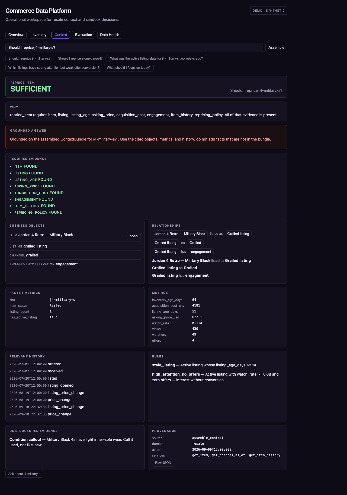

# Commerce Data Platform

[](https://github.com/sebmvp/commerce-data-platform/actions/workflows/test.yml)

Business questions depend on exact operational state and relationships,
not merely semantically similar documents.

This project models that business context explicitly — items, listings,
channels, events, metrics, rules, notes — and assembles only the evidence
required for a question. When required context is missing, it says so.



## How it works

```
synthetic JSONL seed
        → validated ingest (quarantine, idempotent, one transaction per run)
        → PostgreSQL canonical operational store
        → Context Engine → ContextBundle
        → CLI / FastAPI / MCP / React Context Inspector
        → grounded answer over that bundle (abstains when insufficient)
```

RAG is a possible context *source*, not the architecture. The comparison
in evaluation is a **lexical retrieval baseline** (TF-IDF, no generation).
Redis is not used: nothing here is an async job queue yet.

## What you can demonstrate

- A sufficient reprice question with linked objects, history, and provenance
- An insufficient question that names the missing listing/engagement
- Item drill-down (current state + timeline)
- Deterministic gold evaluation (engine, not an LLM)
- The same ids against lexical retrieval
- A thin grounded answer that abstains when `sufficient` is false

## Run

```bash
python -m venv .venv && source .venv/bin/activate
pip install -e ".[dev,api,mcp]"
make doctor
make up          # docker compose postgres, or a local Postgres on :5432
make seed
make test
make eval        # GOLD / DEVELOPMENT — total / pass / fail / skip
make demo        # http://127.0.0.1:5173  visual Context Inspector
```

`make demo` starts the API and inspector. `cdp demo` is the CLI/system
behavior story (isolated database). `Makefile` is the developer lifecycle;
`cdp` is product behavior (`status`, `context`, `answer`, `eval`, `demo`,
`business item <sku>`, `action`, `mcp`).

## Evaluation

Gold questions score `assemble_context`, not an LLM. Cases include
current facts, as-of listing state, channel comparison, listing
performance, missing context, and hybrid structured + note questions.

A separate **held-out** world (`make seed-heldout` / `make eval-heldout`)
runs the same intents against different items and dates. That is
held-out scenario validation, not a generalization claim.

`cdp eval --compare` (or `GET /eval/compare`) runs the same ids against
a lexical TF-IDF baseline over serialized warehouse rows. Hybrid note
questions are expected to tie; multi-hop and missing-context disclosure
are not.

`cdp answer` runs a thin grounded path over that bundle. The default
provider is fake. A real model is used only when `CDP_LLM_API_KEY` is
set. Insufficient bundles abstain.

Relative phrases such as "two weeks ago" resolve against the world clock
in `sample_data/world.json`, so next month's run matches this one.
`CDP_AS_OF=now` uses the wall clock.

## Boundaries

- Public data is synthetic. Scenarios were calibrated from real resale
  workflow patterns (dual channel, unlisted capital, in-transit supply,
  missing cost/engagement). Private rows are never committed.
- This is not a scale claim and not live marketplace integration.
- Grounded answers use the ContextBundle. Default provider is fake; no keys in the repo.
- The published LICENSE is MIT (already on GitHub). That is not an
  invitation to treat private business data as public.

## Reference

| Layer | Path |
|-------|------|
| Charter | [AGENTS.md](AGENTS.md) |
| Schema | `schema/001_init.sql` + Alembic |
| Demo world | `sample_data/` + `scripts/generate_public_world.py` |
| Held-out world | `sample_data_heldout/` + `scripts/generate_heldout_world.py` |
| Context engine | `src/cdp_cli/context/` |
| Gold eval | `evals/context_questions.py` |
| Held-out eval | `evals/heldout_questions.py` |
| Lexical baseline | `evals/lexical_baseline.py` |
| Inspector | `web/` |
| Detail | [ARCHITECTURE.md](ARCHITECTURE.md) · [DEVELOPER.md](DEVELOPER.md) · [docs/DEMO.md](docs/DEMO.md) |
