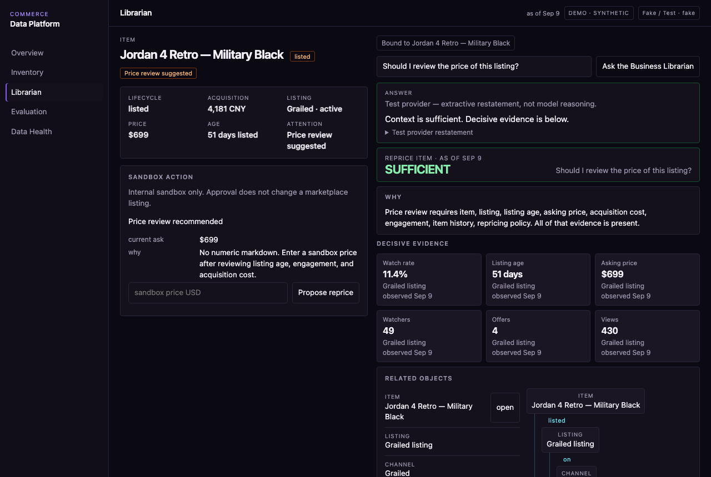

# Commerce Data Platform

[](https://github.com/sebmvp/commerce-data-platform/actions/workflows/test.yml)

Business questions depend on exact operational state and relationships,
not merely semantically similar documents.

This project models that business context explicitly and assembles only
the evidence required for a question. When required context is missing,
it says so.

The **resale domain is the first implementation**. Context contracts and
interface layers are kept separate from domain-specific resolvers,
metrics, and rules so additional operational domains can reuse the same
context machinery. The repository does not currently implement other
businesses.



The operator workspace is object-centric: Overview (attention), Inventory
(object explorer), and the Business Librarian. The Librarian maps a
question to registered domain capabilities, assembles the required
context, and answers only when that evidence is sufficient.

## How it works

```
DATA STEWARD  →  proposed source contract  →  human approval
        → deterministic ingest → PostgreSQL canonical store
        → domain services
        → BUSINESS LIBRARIAN (registered capabilities)
        → Context Engine → ContextBundle
        → sufficiency / evidence → LLM (interpret / explain / propose)
        → human-approved sandbox action
```

The Business Librarian does not receive the entire database in a prompt.
It calls registered read tools. RAG / lexical retrieval is a possible
context *source*, not the architecture. The evaluation comparison is a
**lexical retrieval baseline** (TF-IDF, no generation). Redis is not
used: nothing here is an async job queue yet.

The Data Steward profiles a new source and proposes a data contract for
human review. Deterministic adapters remain responsible for canonical
ingestion.

## Run

```bash
python -m venv .venv && source .venv/bin/activate
pip install -e ".[dev,api,mcp]"
make doctor
make up          # docker compose postgres, or a local Postgres on :5432
make seed
make test
make eval        # GOLD / DEVELOPMENT — total / pass / fail / skip
make demo        # http://127.0.0.1:5173  operator workspace
make reset-demo  # rebuild demo world (clears sandbox actions)
```

`make demo` starts the API and operator workspace. `cdp demo` is the CLI/system
behavior story (isolated database). `Makefile` is the developer lifecycle;
`cdp` is product behavior (`status`, `context`, `answer`, `eval`, `demo`,
`business item <sku>`, `action`, `mcp`).

## Evaluation

Gold questions score `assemble_context`, not an LLM. Cases include
current facts, as-of listing state, channel comparison, listing
performance, missing context, and hybrid structured + note questions.

A separate **held-out** world (`make seed-heldout` / `make eval-heldout`)
runs the same intents against different items and dates. That is
held-out scenario validation, not a generalization claim.

`cdp eval --compare` (or `GET /eval/compare`) runs the same ids against
a lexical TF-IDF baseline over serialized warehouse rows. Hybrid note
questions are expected to tie; multi-hop and missing-context disclosure
are not.

`cdp eval --answers` (or `GET /eval/answers`) scores the grounded
copilot contract on those same ids. `cdp eval --plan` scores capability
mapping. `cdp eval --librarian` scores the registered-tool Librarian
loop. Those layers are reported separately. They are not an LLM-as-judge
and not a combined accuracy number.

`cdp answer` runs the Business Librarian over registered read tools, then
grounds the answer on the exact ContextBundle used. The default
provider is fake and extractive. A real model is used only when
`CDP_MODEL_PROVIDER=openai_compatible`. Local endpoints do not need a
key. Insufficient bundles abstain. See [docs/ai.md](docs/ai.md).

Relative phrases such as "two weeks ago" resolve against the world clock
in `sample_data/world.json`, so next month's run matches this one.
`CDP_AS_OF=now` uses the wall clock.

## Boundaries

- Public data is synthetic. A few dimensions copy rounded private
  operational *patterns* (size, state mix, cost missingness, owned vs
  listed). Dual-channel, engagement paths, and notes/policies are
  illustrative. Private rows are never committed.
- This is not a scale claim and not live marketplace integration.
- Grounded answers use the ContextBundle. Default provider is fake; no keys in the repo.
  Fake output is extractive, not model reasoning. See [docs/ai.md](docs/ai.md).
- The published LICENSE is MIT (already on GitHub). That is not an
  invitation to treat private business data as public.

## Reference

| Layer | Path |
|-------|------|
| Charter | [AGENTS.md](AGENTS.md) |
| Schema | `schema/001_init.sql` + Alembic |
| Demo world | `sample_data/` + `synthetic/resale/` |
| Held-out world | `sample_data_heldout/` + `synthetic/resale/` |
| Context engine | `src/cdp_cli/core/` + `src/cdp_cli/domains/resale/` |
| Gold eval | `evals/context_questions.py` |
| Held-out eval | `evals/heldout_questions.py` |
| Lexical baseline | `evals/lexical_baseline.py` |
| Answer eval | `evals/answer_eval.py` |
| Plan / librarian eval | `evals/plan_eval.py`, `evals/librarian_eval.py` |
| AI runtime | [docs/ai.md](docs/ai.md) |
| Operator UI | `web/` |
| Detail | [ARCHITECTURE.md](ARCHITECTURE.md) · [DEVELOPER.md](DEVELOPER.md) · [docs/DEMO.md](docs/DEMO.md) |
